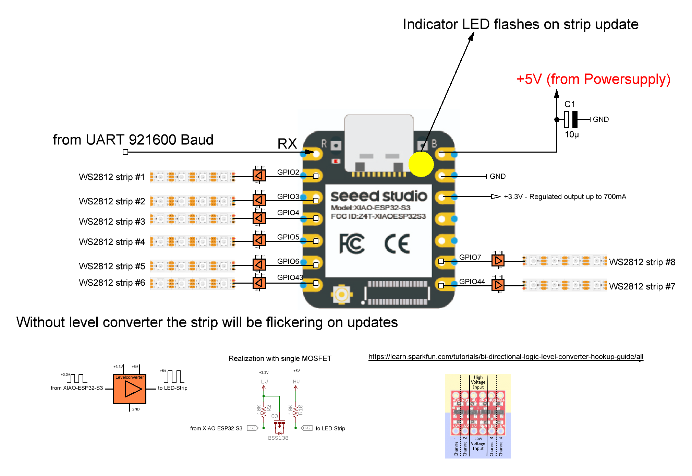

# WS2812 Strip controller 
* Up to 8 strips with up to 1000 pixels per strip
* Controlled by uart input 
* Json schema data format
* 8 independ strips or tied to matrix display

---

## RGB2222 Color Format
The **RGB2222 format** is a method to represent colors in a compact manner using only 6 bits to define a color and 2 bits to define the brightness.   
### Color representatin of one byte   
  
BRIGHTNESS[7:6] RED[5:4] GREEN[3:2] BLUE[1:0]    

Each segment of 2 bits can represent 4 intensity levels (from 0 to 3).  

Possible values for each **COLOR channel (RGB)**:  
00: No intensity (off)  
01: Low intensity  
10: Medium intensity  
11: Full intensity  

Possible values for the **BRIGHTNESS channel**:  
00: Controlled by the brigthness value from the strip  
01: Low intensity  
10: Medium intensity  
11: Full intensity  

---

## JSON Schema data format

### Key strip - select strip  
{"strip":<NUMBER_OF_STRIP>}    

### Key strips - select multiple strips  
{"strips":[<NUMBER_OF_STRIP1>,<NUMBER_OF_STRIP2>,<NUMBER_OF_STRIP3>]}  

## Global Keys ( influencing to ALL strips)  
{"animation":0}  - disable animation for all strips   
{"animation":1}  - enables animation for all strips   
default: animation = 0  

### Setup independent strip examples 

Strip#1 is only one LED which should be updated instantly and is highest value  
{"strip": 1, "update-mode":"instant", "pixels":1, "brightness":4}  

Strip#2, #3 and #4 consists of 8 LED's and brighness is very low
{"strips": [2,3,4] "update-mode":"instant", "pixels":8, "brightness":0.2}  

Strip#5 is a long strip with 144 LED's and rotating right animation with a speed of 100ms  
{"strip": 5, "update-mode":"instant", "pixels":144, "brightness":2, "animation-mode":"rotate-right", "interval":100}     
Switching off the animation: {"strip": 5,"animation-mode":"off"}    
Changing the speed to 500ms: {"strip": 5,"interval":500}   
Changing rotation direction: {"strip": 5,"animation-mode":"rotate-left"}   

{"strip": 1, "pattern": [100, 240, 200],  "repeat": 1}  // default first=0  
{"strip": 1, "pattern-add": [100, 240, 200],  "first":20, "repeat": 1}  
{"strip": 1, "pattern-add": [100, 240, 200],  "repeat": 2, "first": 40}  

{"strip": 1, "update-mode":"triggered", "pixels":100, "pattern-add": [100, 240, 200],  "repeat": 1, "interval":100, "animation-mode":"rotate-right"}  

{"strip": 1, "animation":0,"animation-mode":"rotate-right", "interval":30, "pixels":256, "pattern": [36],  "repeat": 0, "brightness":4.0} 

{"strip": 2, "update-mode":"instant", "pixels":100, "repeat": 0, "interval":100, "animation-mode":"rotate-right"}  

{"strips": [1,2], "pattern": [100, 240, 200]}  
{"strip": 1, "pattern-add": [100, 240, 200], "first":20}  

### Setup matrix display strips
{"strips": [1,2,3,4,5,6,7,8], "update-mode":"triggered","pixels":144}    

Display with 8 rows and 144 coloumns, so we have 8 * 144 = 1152 Pixels managed  

{"animation":0}

{"animation":1}

{"update-trigger":1}

### 

